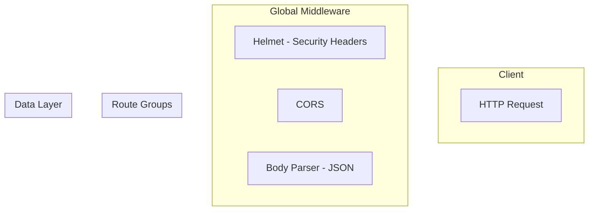

# Codebase Architecture Diagram Generator

Generate or update Mermaid architecture diagrams that reflect the current state of the codebase. The diagram is saved to `docs/architecture.md` and can also be rendered inline.

## When to Use

- After adding new endpoints, routes, or models (e.g., after using the `api-endpoint-scaffolder` agent)
- After running a database migration that adds/changes tables
- When onboarding a new developer who needs to understand the architecture
- When reviewing the current system design
- When the user asks to "update the diagram" or "show me the architecture"

## Procedure

### Step 1 — Scan the Codebase

Read these files in order to build the full architecture picture:

1. **`src/app.ts`** — Find all registered route prefixes (`app.use(...)`) and global middleware (helmet, cors, rate limiter, body parser, error handlers)
2. **`src/routes/*.routes.ts`** — For each route file, map every endpoint: HTTP method, path, middleware chain (validators, auth), and controller function
3. **`src/middleware/auth.middleware.ts`** — Identify exported auth functions: `authenticate`, `requireJWT`, `optionalAuthenticate`
4. **`src/middleware/validators/*.validator.ts`** — List all validator middleware functions
5. **`src/controllers/*.controller.ts`** — Map controller functions to the models they call
6. **`src/models/*.model.ts`** — Map models to their database table names and key methods
7. **`src/config/auth.ts`** — Note auth configuration (rate limit settings, JWT config)
8. **`src/middleware/errorHandler.ts`** — Note error handling middleware

### Step 2 — Determine Diagram Scope

Based on the user's request, generate one or more of these diagram types:

#### Full Architecture (default)

Shows the complete request flow from client to database:

```
Client → Express App → [Global Middleware] → Route Groups → [Auth + Validators] → Controllers → Models → PostgreSQL
```

Include:

- All route groups with their base paths
- Auth level per route (`public`, `rateLimited`, `authenticate`, `requireJWT`)
- Middleware chain for each route group
- Controller-to-model relationships
- Model-to-table mappings
- Error handler flow

#### Auth Flow

Focused diagram showing:

- JWT authentication flow (login → token → verify → access)
- API Key authentication flow (create → hash → verify → access)
- Token refresh flow
- Middleware decision tree (`authenticate` → JWT or API Key?)

#### Database Schema

Entity-relationship diagram showing:

- All tables with columns and types
- Foreign key relationships
- Indexes
- Constraints

#### Single Resource

Focused diagram for a specific resource showing:

- All endpoints for that resource
- Request → middleware → controller → model → database flow
- Validation rules

### Step 3 — Generate the Mermaid Diagram

Build the Mermaid markup following the conventions in [./references/diagram-conventions.md](./references/diagram-conventions.md).

### Step 4 — Validate and Render

1. Use the `mermaid-diagram-validator` tool to validate the Mermaid syntax
2. Use `renderMermaidDiagram` to render and display the diagram to the user
3. If validation fails, fix the syntax and re-validate

### Step 5 — Save to Documentation

1. Create or update `docs/architecture.md` with the generated diagram
2. The file should contain:
   - A title and generation date
   - The Mermaid code block
   - A brief legend explaining the node shapes and colors
   - A "Last updated" timestamp

If `docs/architecture.md` already exists, update only the relevant diagram section. Preserve any manually added notes or sections.

## Diagram Structure Template

For the **full architecture** diagram, use this structure:



## Constraints

- ALWAYS read the actual source files — never assume the architecture from memory
- ALWAYS validate the Mermaid syntax before saving
- ALWAYS render the diagram so the user can see it
- DO NOT hardcode endpoints — dynamically discover them from route files
- DO NOT include implementation details (function bodies, SQL queries) — only show structure
- DO NOT modify any source code — this skill is read-only except for `docs/architecture.md`
- KEEP diagrams readable — if the architecture is large, split into multiple focused diagrams
