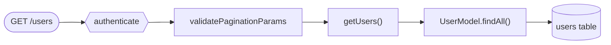

# Mermaid Diagram Conventions

Consistent styling rules for all architecture diagrams in this project.

## Node Shapes

| Shape             | Meaning                 | Mermaid Syntax    |
| ----------------- | ----------------------- | ----------------- |
| Rounded rectangle | Route group / subgraph  | `subgraph "Name"` |
| Rectangle         | Middleware / Controller | `NodeId[Label]`   |
| Stadium           | HTTP endpoint           | `NodeId([Label])` |
| Cylinder          | Database table          | `NodeId[(Label)]` |
| Hexagon           | Auth middleware         | `NodeId{{Label}}` |
| Diamond           | Decision point          | `NodeId{Label}`   |

## Color Coding (CSS classes)

```mermaid
%%{init: {'theme': 'base', 'themeVariables': {'fontSize': '14px'}}}%%
```

Use `classDef` for consistent coloring:

```mermaid
classDef public fill:#d4edda,stroke:#28a745,color:#000
classDef authenticated fill:#fff3cd,stroke:#ffc107,color:#000
classDef jwtOnly fill:#f8d7da,stroke:#dc3545,color:#000
classDef rateLimited fill:#e2e3f1,stroke:#6c757d,color:#000
classDef model fill:#cce5ff,stroke:#007bff,color:#000
classDef database fill:#d1ecf1,stroke:#17a2b8,color:#000
```

| Class           | Color  | Use For                                             |
| --------------- | ------ | --------------------------------------------------- |
| `public`        | Green  | Public endpoints (no auth)                          |
| `authenticated` | Yellow | Endpoints requiring `authenticate` (JWT or API Key) |
| `jwtOnly`       | Red    | Endpoints requiring `requireJWT`                    |
| `rateLimited`   | Gray   | Rate-limited route groups                           |
| `model`         | Blue   | Model / data access layer                           |
| `database`      | Cyan   | Database tables                                     |

## Auth Level Labels

Use these labels on edges connecting to route groups:

- `|public|` — No authentication required
- `|rateLimited|` — Rate limited but no auth
- `|authenticate|` — JWT or API Key required
- `|requireJWT|` — JWT only (no API Key)

## Naming Conventions

- **Route nodes**: Use the HTTP method + path, e.g., `GET_users(["GET /users"])`
- **Controller nodes**: Use the function name, e.g., `getUsers["getUsers()"]`
- **Model nodes**: Use the class name, e.g., `UserModel["UserModel"]`
- **Table nodes**: Use the table name, e.g., `users_table[("users")]`
- **Middleware nodes**: Use the function name, e.g., `authenticate{{"authenticate"}}`

## Layout Guidelines

1. **Flow direction**: Use `graph TB` (top-to-bottom) for full architecture, `graph LR` (left-to-right) for single-resource flows
2. **Subgraphs**: Group related nodes (e.g., all `/auth/*` routes in one subgraph)
3. **Max width**: Keep subgraphs to 4-5 nodes wide to maintain readability
4. **Split large diagrams**: If the architecture has more than 5 route groups, generate multiple focused diagrams instead of one massive diagram

## Example: Single Resource Flow


